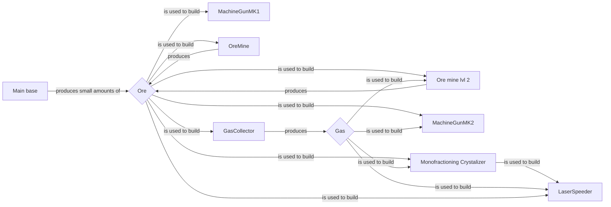

Building hierarchy

```mermaid
graph LR

Base[Main base] -- produces small amounts of -->Ore
  Ore{Ore} -- is used to build --> MachineGunMK1
  Ore{Ore} -- is used to build --> OreMine
  Ore{Ore} -- is used to build --> GasCollector
  OreMine -- produces --> Ore
  OreMine2 -- produces --> Ore
  GasCollector -- produces --> Gas{Gas}

  Ore{Ore} -- is used to build --> OreMine2[Ore mine lvl 2]
  Gas -- is used to build --> OreMine2
  Ore{Ore} -- is used to build --> MachineGunMK2
  Gas -- is used to build --> MachineGunMK2

  Ore{Ore} -- is used to build --> Crystalizer[Monofractioning Crystalizer]
  Gas -- is used to build --> Crystalizer
  Crystalizer -- is used to build --> LaserSpeeder
  Gas -- is used to build --> LaserSpeeder
  Ore -- is used to build --> LaserSpeeder
```