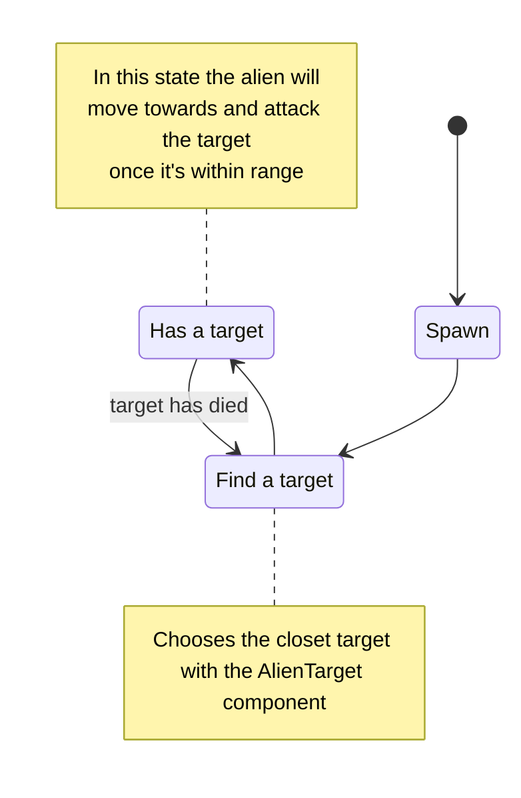

Alien AI

```mermaid
stateDiagram
  state "Has a target" as hasTarget
  note left of hasTarget
    In this state the alien will
    move towards and attack the target
    once it's within range
  end note

  state "Find a target" as findTarget
  note right of findTarget
    Chooses the closet target 
    with the AlienTarget component
  end note

  hasTarget --> findTarget : target has died 
  [*] --> Spawn
  findTarget --> hasTarget
  Spawn --> findTarget

```
