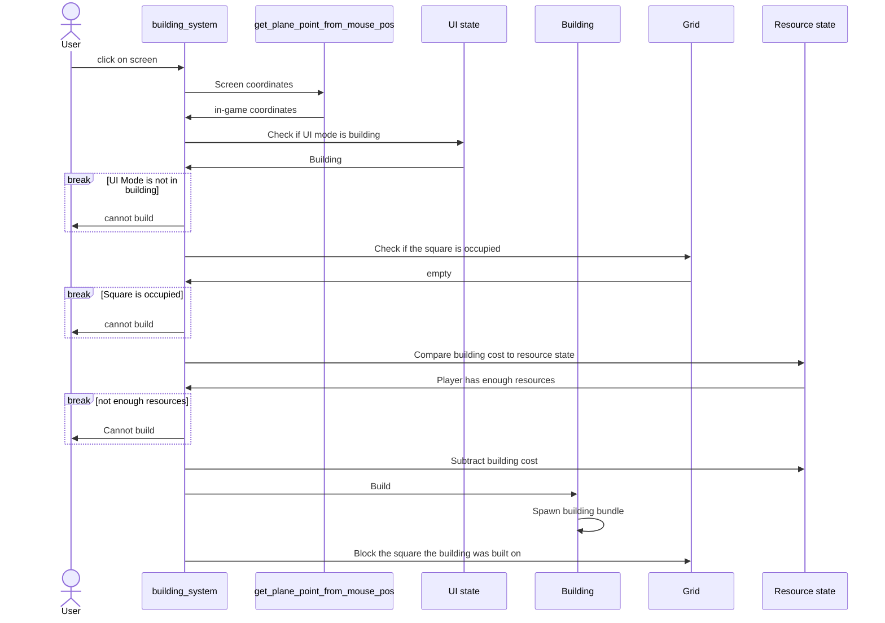

Building Diagram

```mermaid
sequenceDiagram
  actor User
  participant B as building_system
  User->>B: click on screen
  B->>get_plane_point_from_mouse_pos: Screen coordinates
  get_plane_point_from_mouse_pos->>B: in-game coordinates

  participant UI as UI state
  B->>UI: Check if UI mode is building
  UI->>B: Building
  break UI Mode is not in building
    B->>User: cannot build
  end
  participant BT as Building
  B->>Grid: Check if the square is occupied
  Grid->>B: empty
  break Square is occupied
    B->>User: cannot build
  end
  participant R as Resource state
  B->>R: Compare building cost to resource state
  R->>B: Player has enough resources
  break not enough resources
  B->>User: Cannot build
  end
  B->>R: Subtract building cost
  B->>BT: Build
  BT->>BT: Spawn building bundle
  B->>Grid: Block the square the building was built on
```