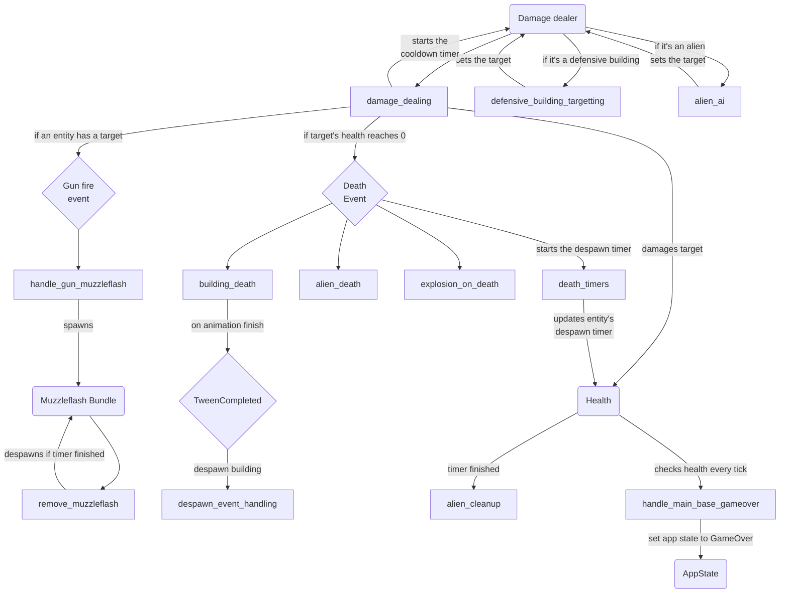

Damage dealing

```mermaid
graph TD

Gun(Damage dealer) --> damage_dealing

Gun -- if it's a defensive building --> defensive_building_targetting
Gun -- if it's an alien--> alien_ai -- sets the target --> Gun
defensive_building_targetting -- sets the target --> Gun

damage_dealing -- starts the <br/> cooldown timer  --> Gun

damage_dealing -- if an entity has a target --> GFEvent{Gun fire <br/> event}

GFEvent --> handle_gun_muzzleflash
handle_gun_muzzleflash -- spawns --> M(Muzzleflash Bundle)
M --> remove_muzzleflash
remove_muzzleflash -- despawns if timer finished --> M

damage_dealing -- damages target --> H(Health)
damage_dealing -- if target's health reaches 0 --> DE{Death <br/> Event}

DE -- starts the despawn timer --> death_timers -- updates entity's <br/>despawn timer --> H
DE --> alien_death
DE --> explosion_on_death
DE --> building_death -- on animation finish --> T{TweenCompleted} 
T -- despawn building --> despawn_event_handling

H -- timer finished --> alien_cleanup
H -- checks health every tick --> handle_main_base_gameover -- set app state to GameOver --> GO(AppState)
```
